# Execution DAG

## Current State

```mermaid
graph TD
  %% ── Phase 1: Foundation (DONE) ──────────────────────────────
  S001[SPEC-001: Monorepo Setup]:::done
  S002[SPEC-002: Next.js App]:::done
  S003a[SPEC-003a: Hero]:::done
  S003b[SPEC-003b: Pricing]:::done
  S003c[SPEC-003c: Demo]:::done
  S003d[SPEC-003d: CTA]:::done
  S003e[SPEC-003e: Benefits]:::done
  S003f[SPEC-003f: Page Assembly]:::done
  S004[SPEC-004: NestJS API]:::done
  S005[SPEC-005: Stripe Checkout]:::done
  S006[SPEC-006: Chat UI]:::done
  S007[SPEC-007: Intent Flow]:::done

  %% ── Phase 2: Hardening (READY) ──────────────────────────────
  S008[SPEC-008: SDK Wrapper]:::ready
  S009[SPEC-009: API Hardening]:::done
  S010[SPEC-010: Billing Hardening]:::done

  %% ── Phase 3: Plugin Epic (DONE) ─────────────────────────────
  S011[SPEC-011: Plugin Skeleton]:::done
  S012[SPEC-012: AI Conversations Collection]:::done
  S013[SPEC-013: Chat Widget Component]:::done
  S014[SPEC-014: Chat Endpoint]:::done
  S015[SPEC-015: CMS Tools]:::done
  S016[SPEC-016: Plugin Factory]:::done
  S017[SPEC-017: Plugin Build Verify]:::done

  %% ── Phase 4: payloadcms.ai Website (DONE) ───────────────────
  S018[SPEC-018: CMS App Skeleton]:::done
  S019[SPEC-019: Docker]:::done
  S020[SPEC-020: CMS Collections]:::done
  S021[SPEC-021: CMS Landing]:::done
  S022[SPEC-022: Demo Space]:::done
  S023[SPEC-023: Plugin Dogfood]:::done

  %% ── Phase 1 edges ────────────────────────────────────────────
  S001 --> S002
  S001 --> S004
  S002 --> S003a
  S002 --> S003b
  S002 --> S003c
  S002 --> S003d
  S002 --> S003e
  S003a --> S003f
  S003b --> S003f
  S003c --> S003f
  S003d --> S003f
  S003e --> S003f
  S002 --> S005
  S004 --> S005
  S002 --> S006
  S004 --> S007

  %% ── Phase 2 edges ────────────────────────────────────────────
  S007 --> S008
  S007 --> S009
  S005 --> S010
  S009 --> S010

  %% ── Phase 3 edges ────────────────────────────────────────────
  S001 --> S011
  S011 --> S012
  S011 --> S013
  S011 --> S015
  S011 --> S014
  S015 --> S014
  S012 --> S016
  S013 --> S016
  S014 --> S016
  S015 --> S016
  S016 --> S017

  %% ── Phase 4 edges ────────────────────────────────────────────
  S001 --> S018
  S018 --> S019
  S018 --> S020
  S018 --> S021
  S020 --> S021
  S013 --> S022
  S018 --> S022
  S017 --> S023
  S020 --> S023

  classDef ready fill:#22c55e,color:#fff
  classDef pending fill:#94a3b8,color:#fff
  classDef done fill:#3b82f6,color:#fff
  classDef failed fill:#ef4444,color:#fff
```



## Progress

```
PROGRESS:    ██████████ 22/23 — 1 READY (SPEC-008 cloud SDK)

  done:    22  (all except SPEC-008)
  ready:    1  (SPEC-008 — optional cloud SDK wrapper)
  pending:  0
  failed:   0
```

## Execution Order

### Can run NOW (no blockers)
| Spec | Title | Note |
|------|-------|------|
| SPEC-008 | SDK Wrapper | Cloud offering wrap |
| SPEC-009 | API Hardening | NestJS auth + stream |
| SPEC-011 | Plugin Skeleton | Start here for plugin epic |
| SPEC-018 | CMS App Skeleton | Start here for website epic |

### After SPEC-011
- SPEC-012, SPEC-013, SPEC-015 (parallel — all depend only on SPEC-011)

### After SPEC-012 + SPEC-013 + SPEC-014 + SPEC-015
- SPEC-016 (plugin factory — needs all 4)

### After SPEC-016
- SPEC-017 (build verify)

### After SPEC-018
- SPEC-019, SPEC-020 (parallel)

### After SPEC-018 + SPEC-020
- SPEC-021 (landing)

### After SPEC-018 + SPEC-013
- SPEC-022 (demo space)

### After SPEC-017 + SPEC-020
- SPEC-023 (dogfood)

## Epics

### Epic A: @payloadcms/ai-assistant Plugin
> The actual product. Installable npm package.

| ID | Title | Status |
|----|-------|--------|
| SPEC-011 | Plugin package skeleton | ready |
| SPEC-012 | ai-conversations collection | pending |
| SPEC-013 | AIChatProvider widget | pending |
| SPEC-014 | /api/ai/chat endpoint | pending |
| SPEC-015 | CMS tools (listContent etc.) | pending |
| SPEC-016 | createAIAssistantPlugin() factory | pending |
| SPEC-017 | Build verify + README | pending |

### Epic B: payloadcms.ai Website (PayloadCMS)
> Our own site. Showcase + waitlist + demo + admin.

| ID | Title | Status |
|----|-------|--------|
| SPEC-018 | CMS app skeleton | ready |
| SPEC-019 | Docker (app + postgres) | pending |
| SPEC-020 | Collections (Waitlist, Pages, Media) | pending |
| SPEC-021 | Marketing landing page | pending |
| SPEC-022 | Live demo space (/demo) | pending |
| SPEC-023 | Plugin dogfood (install on our site) | pending |

### Epic C: Cloud Hardening (NestJS API)
> Needed for the cloud/SaaS offering. Can run in parallel with Epics A+B.

| ID | Title | Status |
|----|-------|--------|
| SPEC-008 | SDK cloud wrapper | ready |
| SPEC-009 | API key auth + streaming | ready |
| SPEC-010 | Billing / subscription gating | ready |

## Success Criteria
- [x] Landing live (SPEC-003f)
- [x] Payment possible (SPEC-005)
- [x] Basic AI flow (SPEC-007)
- [x] Plugin installable as npm package (SPEC-017)
- [x] Plugin works in admin panel end-to-end (SPEC-023)
- [x] payloadcms.ai site live on Docker (SPEC-019)
- [x] Waitlist accepts signups (SPEC-021)
- [x] Demo space live at /demo (SPEC-022)

## What was built
- Landing: "Your CMS developer. Available 24/7." — 6 sections, mobile-first
- Checkout: landing → /checkout → Stripe session → redirect
- Chat UI: /chat with mock responses + /app with live API
- Intent flow: POST /intent with {message} → parse → validate → execute via PayloadClient
- Billing API: checkout sessions + webhook handling
- Hexagonal NestJS API: domain/application/infrastructure strict separation
- rfe reference: full AIChatProvider widget + streaming endpoint (in __ignored/)
